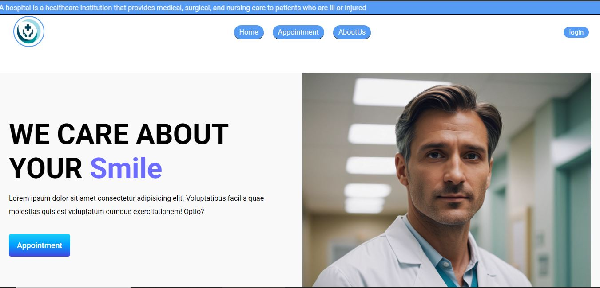
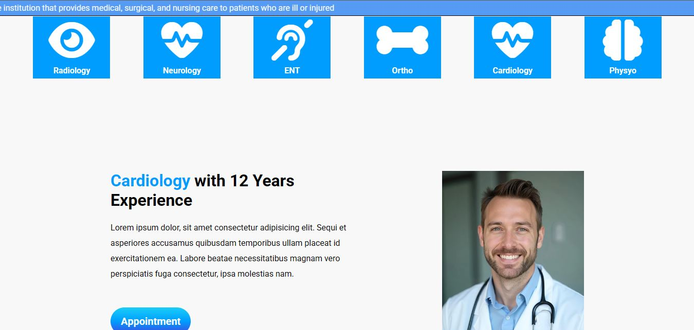
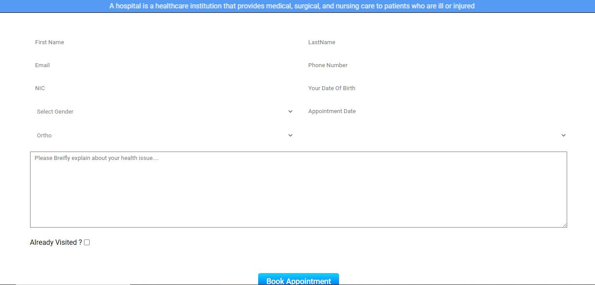
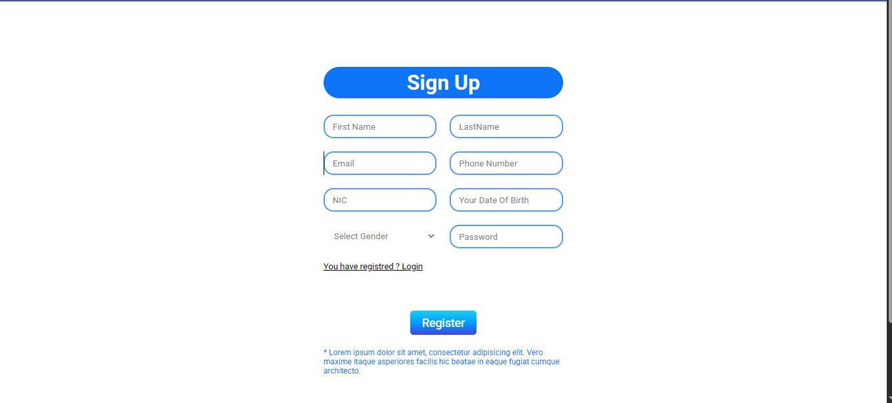

🏥 Hospital Appointment Booking Website
📌 Description

A hospital management and appointment booking website built with React.js (frontend).
This website allows patients to book appointments, check available doctors, view specialists, and get information about different departments.

🚀 Features

📋 Appointment Form – Patients can fill details like name, contact, DOB, gender, department, and health issue description.

👨‍⚕️ Specialist Doctors Section – Displays doctors with their names, photos, and specializations.

🏥 Departments Section – Shows different hospital departments (Cardiology, Ortho, Neurology, Radiology, etc.).

📝 Doctor Profile with Experience – Each department shows doctor details with years of experience.

🖼️ Modern UI Design – Clean layout with responsive design.

🔐 Login Option – Simple login button provided in navbar.

🛠️ Tech Stack

Frontend: React.js, HTML5, CSS3

Styling: Custom CSS / Tailwind (if used)

Icons/Images: Hospital & doctor-related images

⚡ Installation & Setup

Clone this repository

git clone https://github.com/Sachin-Shah-25/Hospital-management.git

Navigate to the project folder

cd hospital-appointment

Install dependencies

npm install

Run the development server

npm start

Open in browser → http://localhost:3000

📸 Screenshots

🏠 Home Page – Hero section with hospital intro.

👨‍⚕️ Doctors Section – Displaying specialists.

🏥 Departments Section – Showcasing hospital departments.

📋 Appointment Page – Form to book appointments.

Login/Signup Page 

🔮 Future Enhancements

✅ Online payment gateway for appointment booking

👨‍💻 Author
Developed by Sachin Shah 🚀
